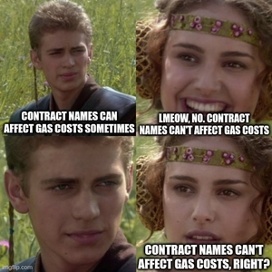

# ⛳ Re:Golf Course

Proof-of-concept [Golf Course](https://github.com/Rari-Capital/golf-course) reimagined with [`GClub`](src/utils/GClub.sol) and a golf theme.

## Table of contents
  - [Tips](#tips)
    - [Caddie](#-caddie)
    - [Golf Pro](#-golf-pro)
    - [World Champ](#-world-champ)
  - [Myths](#myths)

## Tips

### 🧒 Caddie

#### Use `uint` instead of `bool` for reentrancy guard

The initial `SSTORE` of `true` in the unoptimized version costs over 20,000 gas while the second SSTORE of `false` costs only 100.  But both `SSTORE` (for `2` and `1`) cost only 100 gas.

  - [Full Example](src/Reentrancy.sol)

```solidity
// 🚩 Unoptimized
bool private locked = false;
modifier nonReentrant() {
    require(locked == false, "REENTRANCY");
    locked = true;
    _;
    locked = false;
}


// 🏌️ Optimized (-20000 gas)
bool private locked = 1;
modifier nonReentrant() {
    require(locked == 1, "REENTRANCY");
    locked = 2;
    _;
    locked = 1;
}
```

#### When iterating through a storage array, cache the array length first

Caching the array length first saves an `SLOAD` on each iteration of the loop.
  - [Full Example](src/CacheArrLength.sol)

```solidity
uint256[] public arr = [uint256(1), 2, 3, 4, 5, 6, 7, 8, 9, 10];

// 🚩 Unoptimized
for (uint256 index; index < arr.length; ++index) {}

// 🏌️ Optimized (-1000 gas)
uint256 arrLength = arr.length;
for (uint256 index; index < arrLength; ++index) {}
```

### 🧤 Golf Pro

#### Make functions `payable`

Making functions `payable` eliminates the need for an initial check of `msg.value == 0` and saves 21 gas.

**Note:** This conservatively assumes the function could be `pure` if not for the `payable`.  When compared against a non-`pure` function the savings is more (24 gas). When used for a constructor, the savings is on deployment.

Adding a `payable` function where none existed previously could introduce a security risk. Use with caution.

  - [Full Example](src/PayableFunctions.sol)

```solidity
// 🚩 Unoptimized
function doSomething() public {}

// 🏌️ Optimized (-24 gas)
function doSomething() payable public {}
```

### 🏆 World Champ

#### Function ordering

The compiler orders public and external members of a contract by their Method ID.

Calling a function at runtime will be cheaper if the function is positioned earlier in the order (has a relatively lower Method ID) because 22 gas are added to the cost of a function for every position that came before it. The average caller will save on gas if you prioritize most called functions.

[This tool](https://emn178.github.io/solidity-optimize-name/) helps you find alternative function names with lower Method IDs.

- [Full Example](src/FunctionOrdering.sol)

```solidity
// 🚩 Unoptimized

bytes32 public occasionallyCalled;
// Method ID: 0x13216062  (position: 1, gas: 2261)

function mostCalled() public {}
// Method ID: 0xd0755f53  (position: 3, gas:  142)

function leastCalled() public {}
// Method ID: 0x24de5553  (position: 2, gas:  120)


// 🏌️ Optimized

bytes32 public occasionallyCalled;
// Method ID: 0x13216062  (position: 2, gas: 2283)

function mostCalled_41q() public {}
// Method ID: 0x0000a818  (position: 1, gas:   98)

function leastCalled() public {}
// Method ID: 0x24de5553  (position: 3, gas:  142)
```

## Myths

#### Contract names cannot affect gas costs

*Taking a break from all the golfing...*


